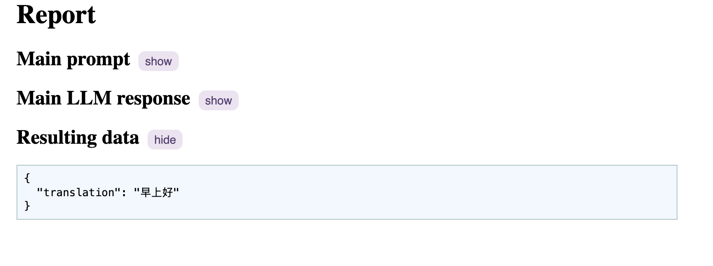
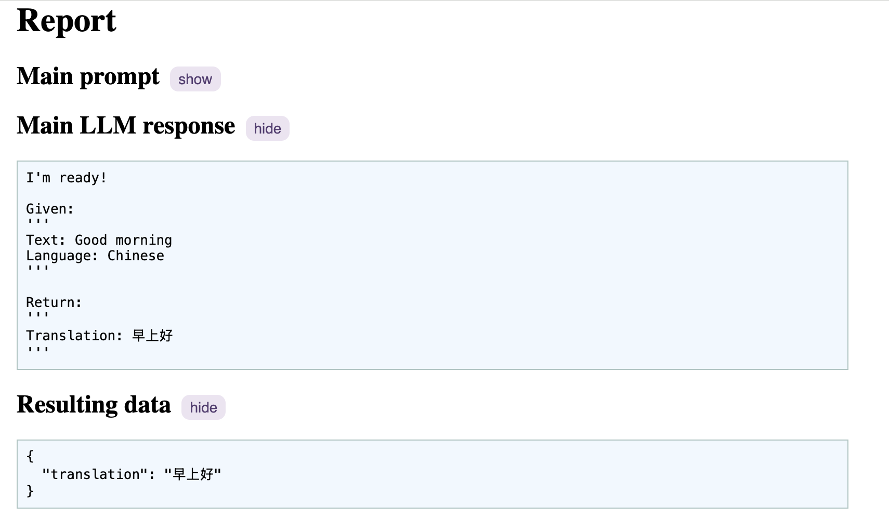
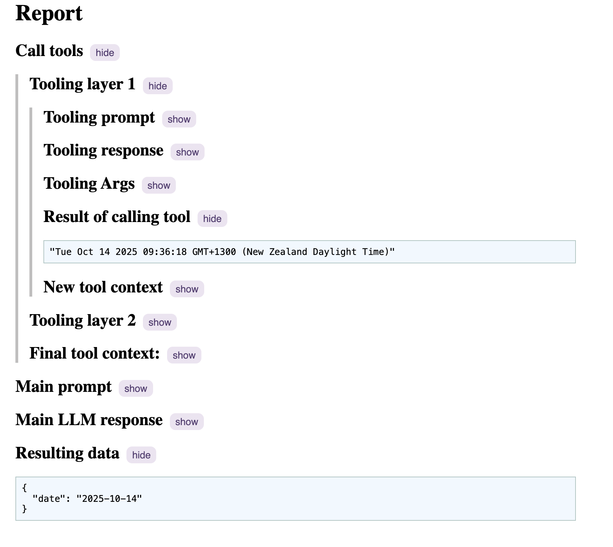

# Debugging

In addition to providing you with the LLM prompt and it's raw response in the response you get back from your function call, Soda AI also provides step-by-step logging in an easy-to-read HTML format. All you need to do is run your function with the debug option turned on.

```ts
await translate(
  {
    text: "Good morning",
    language: "Chinese",
  },
  {
    debug: true,
  }
);
```

After running (or even failing), you will now see `./bin/debug.html`. If you open it in your browser, you will be able to see what happened at each step in the flow:



Click 'show' on one of the headings to expand that section and see more:



You can also see details of tool calling if your function supports it:


