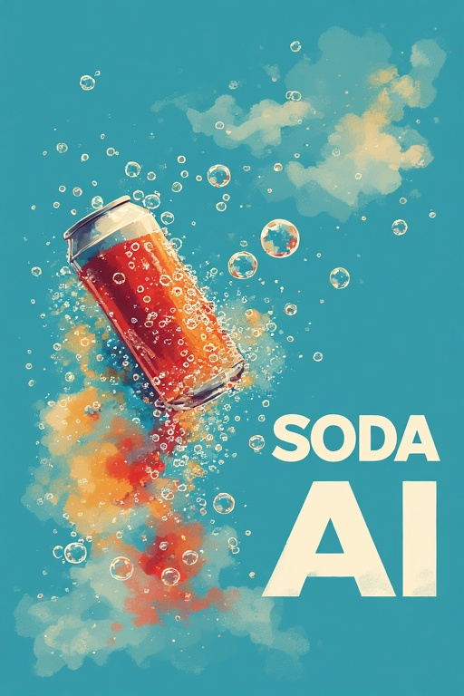

# Welcome to SODA-AI!



**Note: This is just a pet-project / PoC at the moment. If you find it useful, have suggestions for improvements, or want to help please reach out.**

SODA-AI stands for Schema Object Driven Agentic AI.

It's inspired by DSPy but focuses more on defining inputs and outputs via a Zod Schema than using Python Signatures.

The basic jist is, you shouldn't have to use natural language (which is brittle and open to interpretation) to make use of LLM's reasoning and problem solving abilities. So why not hide away all the prompt-generation mumbo jumbo behind solid schemas that define exactly what you want and how?

Also, it's all in TypeScript, so no need for Python knowledge to start your journey developing with Agentic AI!

The way I like to think of Soda-Ai is like writing a Docstring that briefly defines:

- what your function does
- what inputs it expects
- what outputs it expects

Except in real coding you can't just stop at a Docstring. You also have to write the code. With Soda-Ai, you don't!

## How it works

### 1. Define a schema and function

```ts
import z from "zod";
import { soda } from "soda-ai";
import { myModel } from "./myModel";

const schema = {
  action: "translate the text into the given language",
  inputs: z.object({
    text: z.string(),
    language: z.string(),
  }),
  outputs: z.object({
    translation: z.string(),
  }),
};

export const translate = soda(myModel, schema);
```

### 2. Call it

```ts
const response = await translate({
    text: '좋은 아침이에요',
    language: "English"
});

console.log(response.data.translation);

> Good morning!
```

## Documentation

Read the [docs](./docs/readme.md) for more details on how to use it.

## Examples:

Look at [examples](./examples/readme.md) to see what's possible and get ideas.
